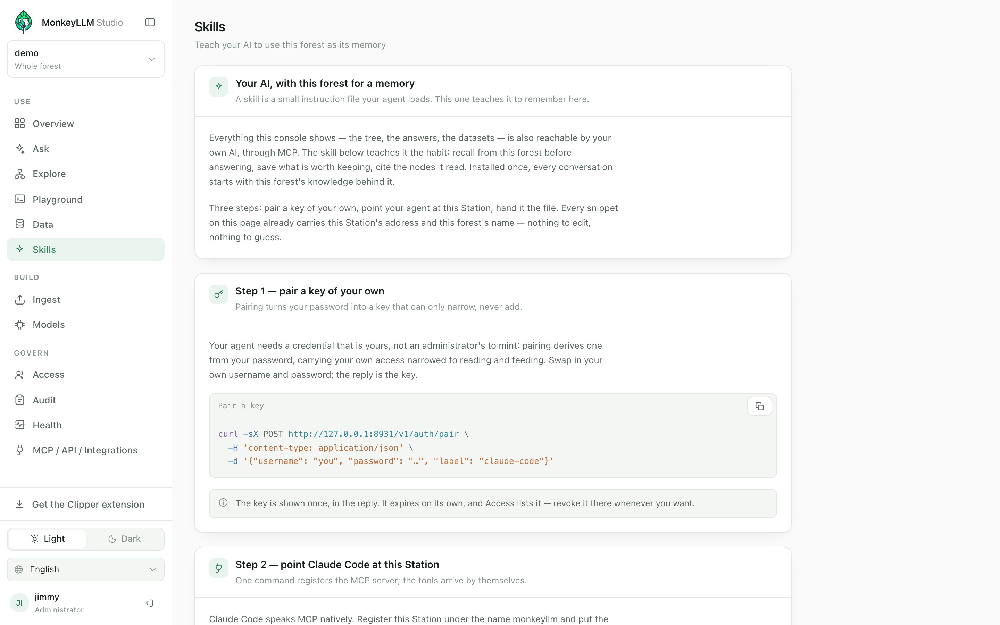
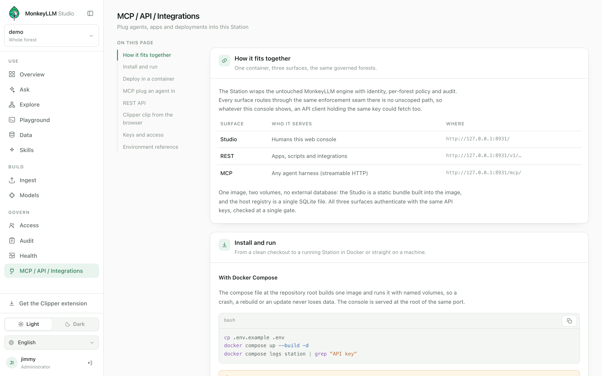

# Connecting your AI

English · [Português](../pt/connecting-ai.md) · [Español](../es/connecting-ai.md)

[← Handbook](./README.md)

This is the page the rest of the handbook has been building toward. Everything
so far — [installing the Station](./install.md), [signing in](./first-access.md),
[asking questions](./using.md), [feeding documents](./feeding.md) — happened
through the Studio. But the Studio is a window. The product is the forest behind
it, and the forest is built to be read and grown by *your own AI*.

## Why

When you connect an agent to a forest, it gains something a chat transcript
never gives it: a **persistent, governed, citable memory**.

- **Persistent** — the forest outlives every conversation. What one session
  plants, the next session recalls. Other people and other agents feed it too,
  and it keeps growing for as long as you keep it.
- **Governed** — the agent holds a key, the key carries your grants, and every
  read and write passes the same enforcement seam the console does. What the
  key cannot reach does not exist for the agent.
- **Citable** — everything the agent reads carries a node id. Answers grounded
  in the forest can say exactly which nodes they stand on.

And there is nothing second-class about the connection. The Station has no
privileged side-channel: whatever the Studio shows you, an API or MCP client
holding the same key could fetch too. The console's Ask page calls the same
`answer` your agent will call. Connecting an AI is not an integration bolted
on the side — it is the front door.

> **Note** — the snippets below use `https://station.example.com` as a
> placeholder. You rarely have to substitute anything by hand: the Skills and
> Integrations consoles render these exact snippets with your Station's real
> address and forest already filled in.

## The three surfaces

One container, three surfaces, the same governed forests. All three
authenticate with the same API keys, checked at a single gate, and every
forest access routes through the same scoped enforcement.

| Surface | Who it serves | Where |
|---|---|---|
| **Studio** | Humans — this web console | `https://station.example.com/` |
| **REST** | Apps, scripts and integrations | `https://station.example.com/v1/…` |
| **MCP** | Any agent harness (streamable HTTP) | `https://station.example.com/mcp/` |

The MCP surface is contract-identical to a local `vine serve`: an agent that
works against a forest on your own disk works against a Station-served forest
with no change beyond the endpoint and a credential. Scoping only ever narrows
*content* — it never changes the shape of a response.

## Pair a key

Your agent needs a credential that is *yours* — not one an administrator has
to mint. Pairing is that door: `POST /v1/auth/pair` is unauthenticated like
login, takes your username and password, and answers with an API key.

```bash
curl -sX POST https://station.example.com/v1/auth/pair \
  -H 'content-type: application/json' \
  -d '{"username": "you", "password": "…", "label": "claude-code"}'
```

The reply carries `api_key` (it looks like `mk_…`), your `principal`, the
key's `caps` and its `expires_at`. What makes a paired key safe to hand to a
machine is that it **can only narrow, never add**:

- **The mask.** A paired key carries a capability mask — `{read, ingest}` by
  default, and that set is also the ceiling: asking for `write`, `tend`,
  `query` or `admin` is refused as `E_SCHEMA`. Those stay what an
  administrator mints deliberately.
- **Grants ∩ mask, at the moment of use.** The key's effective authority is
  your own grants filtered through the mask, computed live — a grant revoked
  after pairing is gone from the key immediately. A paired key held by an
  owner is still refused every admin route.
- **It always expires.** 90 days by default, 365 at most; there is no
  "unlimited". The key is shown once — only its digest is stored.
- **Self-service by construction.** Pairing reaches nothing your password
  could not already reach, so no admin gate stands in front of it. Both
  `login` and `pair` are rate-limited, and the refusal never reveals whether
  a username exists.

The key lives where every key lives: the Access console lists it, and an
administrator can revoke it there at any time (see
[Managing the Station](./managing.md)).

## Claude Code in two commands

If your agent is Claude Code, the whole connection is the pairing call above
plus one registration:

```bash
claude mcp add --transport http monkeyllm https://station.example.com/mcp/ \
  --header "Authorization: Bearer mk_…"
```

From then on the forest's tools are in every session. Two things worth
knowing on the first call:

- Have the agent call `forests()` first. A scoped key has no master index;
  that call returns the forests the key may use and the roots to start from.
- The MCP surface only answers hosts listed in
  `MONKEYLLM_STATION_ALLOWED_HOSTS`. If you serve through a domain, name it
  there (or `*` to skip the check) — every request still needs a key.

## The Skills console

A connected agent knows the tools exist; it does not yet have the *habit* of
using them. The Skills console closes that gap. A skill is a small instruction
file an agent runtime loads, and this one teaches your agent to treat the open
forest as its memory: recall from it before answering, save what is worth
keeping, cite the node ids it read.



The console walks you through the same three steps as this page — pair a key,
point Claude Code at the Station, hand it the file — and every snippet on it
already carries the Station's address and the open forest's name. The skill is
generated in your browser, for that exact deployment; the Station gains no
endpoint for it. It is available to anyone whose key can `read` the forest —
never admin-gated, because pairing made the credential self-service and
learning to connect must be too.

For Claude Code, the file installs at:

```
~/.claude/skills/monkeyllm-memory/SKILL.md
```

The file's own words are worth previewing, because they are the contract your
agent will follow. Under the title **"This forest is your memory"**, it
teaches three sections:

- **Recall before you answer** — for any question the forest could answer,
  recall first and reason after: `answer` when the forest's answer *is* the
  answer; `harvest` when the agent will reason over the material itself;
  `locate` → `look` → `pick` to navigate; `sniff` for literal text inside
  bodies; `query` for datasets, if the key carries `query` — after a `look`,
  because a dataset's `notes` say what the columns mean. And: cite node ids
  for anything asserted from the forest.
- **Save what is worth keeping** — when the user states something durable (a
  decision, a fact, a preference, a correction), offer to keep it, with the
  write the key actually allows: `ingest` — one markdown document through
  the Gardener — is the write a paired key carries by default; `plant` and
  `graft` are taught only for keys that carry `write`. Write in English and
  keep the summary honest — the summary is how the note will be found.
- **Respect the contract** — the key decides what the agent sees and what it
  may write; never work around a refusal — say what was refused and which
  capability it needs. Every read is budgeted, and `truncated: true` means
  ask narrower, not retry harder. Datasets change through `tend` only where
  the key carries it, one statement at a time, never DDL.

> **Note** — the skill file's body is English regardless of the console
> language, on purpose: it addresses the model, not you. The walkthrough
> around it is translated like any other part of the console.

## The MCP tools

The tools are the engine's primitives plus the composites, each behind the
capability it needs. `forests` answers to any valid key; everything else is
gated as shown.

| Tool | Needs | What it does |
|---|---|---|
| `forests` | any key | Lists the forests this key may use, with capabilities and starting roots. |
| `locate` | `read` | Ranked entry points over curated metadata — where to drop into the forest. |
| `look` | `read` | Cheap digest of one node: summary, edges, children, stats. |
| `move` | `read` | Neighbours of a node along typed edges. |
| `pick` | `read` | Reads the body, or one section of it. |
| `scan` | `read` | Filters a branch's nodes by metadata. |
| `sniff` | `read` | Literal search inside bodies — the facts summaries do not carry. |
| `harvest` | `read` | One-shot retrieval: ranked evidence with exact snippets, no hops. |
| `answer` | `read` | A grounded answer written by the model bound to the forest, with its evidence. |
| `view` | `read` | The image payload of a media node, as image content a multimodal client reads into its own context. |
| `query` | `query` | Read-only SQL against a dataset node. |
| `plant` | `write` | Creates a node. |
| `graft` | `write` | Edits a node. |
| `tend` | `tend` | Single-statement dataset write. |
| `ingest` | `ingest` | Puts documents into the forest through the Gardener. |

A reasonable mental model: `answer` and `harvest` are the one-shots, the
`locate`/`look`/`move`/`pick`/`scan`/`sniff` family is navigation, `query` and
`tend` are the dataset pair, and `plant`/`graft`/`ingest` are how the forest
grows.

## The REST surface in five minutes

Scripts and applications speak the same forests over plain HTTP/JSON. Send
the key as a bearer token on every request. If you have a username and
password instead, a login returns a **session token** — an ordinary key with
a 12-hour life — so past the door there is exactly one authorization path:

```bash
curl -sX POST https://station.example.com/v1/auth/login \
  -H 'content-type: application/json' \
  -d '{"username": "admin", "password": "…"}'
```

One route shape covers every primitive: POST the arguments as JSON to the
primitive's name, per forest —
`POST /v1/forests/{forest}/{name}`. Three examples, for a forest named
`handbook`:

```bash
# ask for a grounded answer
curl -sX POST https://station.example.com/v1/forests/handbook/answer \
  -H "Authorization: Bearer $KEY" -H 'content-type: application/json' \
  -d '{"question": "what is our expense policy?"}'
```

```bash
# retrieve evidence without a model
curl -sX POST https://station.example.com/v1/forests/handbook/harvest \
  -H "Authorization: Bearer $KEY" -H 'content-type: application/json' \
  -d '{"query": "expense policy", "terms": ["receipt"], "k": 3}'
```

```bash
# upload documents
curl -sX POST https://station.example.com/v1/forests/handbook/ingest \
  -H "Authorization: Bearer $KEY" -H 'content-type: application/json' \
  -d '{"mode": "upload", "dest": "policies",
       "files": [{"name": "expenses.md", "text": "# Expenses…"}]}'
```

Failures are one envelope, mapped onto HTTP codes, and the `hint` is written
for the caller — show it:

```json
{
  "error": {
    "code": "E_FORBIDDEN",
    "message": "missing or invalid API key",
    "hint": "Send Authorization: Bearer <key>."
  }
}
```

> **Note** — out of scope is indistinguishable from absent. A node the key
> may not see reports `E_NOT_FOUND`, byte for byte the same as a node that
> does not exist. This is deliberate: an error that said "forbidden" would
> itself disclose the node.

## Any other runtime

Nothing above is particular to Claude Code beyond the install path. Any
MCP-capable runtime connects with the same endpoint and the same paired key —
register it wherever your runtime configures MCP servers:

```json
{
  "mcpServers": {
    "monkeyllm": {
      "type": "http",
      "url": "https://station.example.com/mcp/",
      "headers": { "Authorization": "Bearer mk_…" }
    }
  }
}
```

Hand it the same `SKILL.md` instructions, adapted to however your runtime
loads system prompts or skills. The file addresses the model, so it travels.

## What your agent can never do

Connecting an AI does not open a hole in the governance — the agent is a
principal like any other, and the contract holds on every surface.

**Scopes hold.** A grant binds a principal to one forest with capabilities
and branch-prefix scope: allow and deny lists of subtree prefixes, deny wins
at any depth, and no grant means no access. The capabilities are exactly six:

| Capability | Allows |
|---|---|
| `read` | read the material |
| `query` | run read-only SQL |
| `write` | create and edit nodes |
| `tend` | change dataset rows |
| `ingest` | add new documents |
| `admin` | grant access to others |

Scope filtering is applied *before* ranking and budgeting, so an agent cannot
infer hidden content from result counts or truncation flags — and an
out-of-scope node answers exactly like a missing one.

**Budgets hold.** Every read primitive answers within a declared token
budget, and a cut result always says `truncated: true` — never a silent cut:

| Call | Budget (tokens) |
|---|---|
| `look` | 500 |
| `move` | 600 |
| `locate`, `scan`, `sniff` | 800 each |
| `query` | 2000 |
| `pick`, `harvest` | 4000 |

A body over `pick`'s budget comes back as its outline plus a hint to ask for
one section. The budgets are why a forest stays navigable by a small model —
and why the skill teaches "ask narrower, not retry harder".

**Writes stay disciplined.** `plant` and `graft` are atomic git commits
inside the forest; datasets change only through `tend`, one DML statement at
a time, WHERE mandatory on UPDATE and DELETE, no DDL ever. There is no
route by which an agent deletes a node.

**The audit sees everything.** Every scoped read lands in the host registry:
principal, forest, primitive, an argument digest, result size and timestamp —
never bodies. Every write is a git commit stamped with the acting principal.
Which agent read which nodes, in which order, is reconstructible after the
fact — see [Managing the Station](./managing.md).

## Where the full manual lives

This page is the operator's path. The exhaustive reference — every route,
every tool, every deployment knob and environment variable — lives inside the
Studio itself, in the **MCP / API / Integrations** console. It is admin-gated,
because it speaks the administrator's vocabulary: credentials, hosts, the
container.



It is a console rather than a static site on purpose: every example there
carries that Station's own origin, so each snippet is copy-ready for the host
the administrator is actually looking at — documentation that cannot drift
from the deployment it documents. When something on this page and something
in that console disagree, trust the console: it is describing itself.
