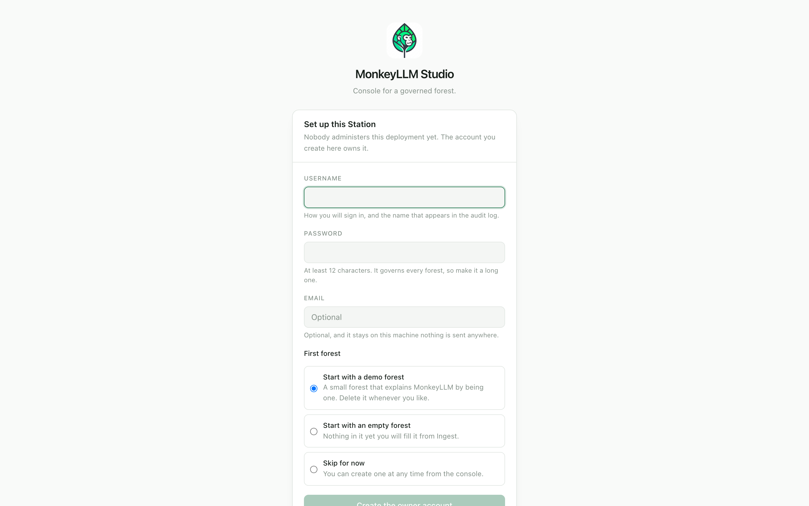
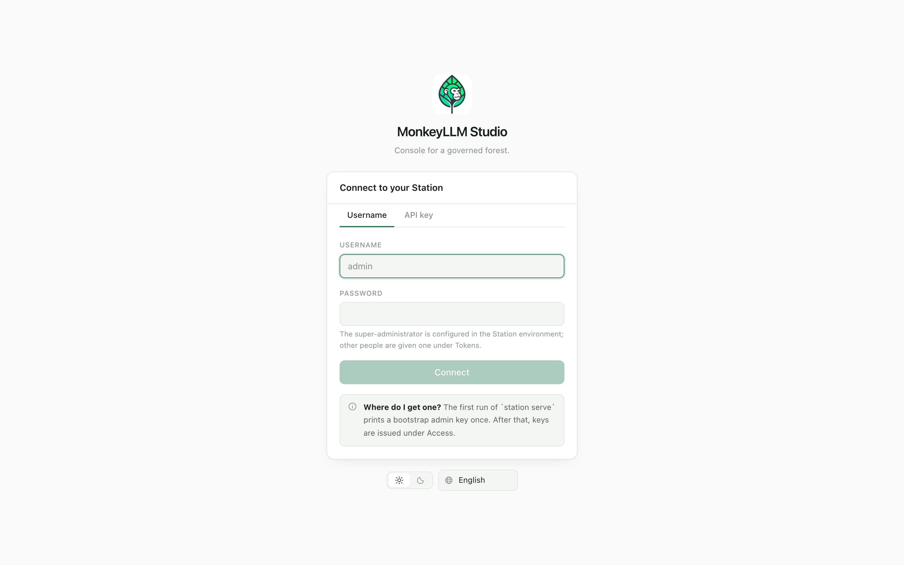

# First access

English · [Português](../pt/first-access.md) · [Español](../es/first-access.md)

[← Handbook](./README.md)

The first minute in the Studio is deliberate. Depending on the state of your
Station you will meet one of two pre-identity screens setup or the gate —
and then, once, a short presentation of what you have actually installed.
This page walks through all three, and then shows you around.

## The setup screen

A Station is installed before it has an administrator, so the very first
visit to a fresh deployment lands on the setup screen: **"Set up this
Station"**. It exists exactly once. While the registry holds no credential
of any kind, `GET /v1/health` reports that setup is required and the console
shows this screen; the moment an owner exists, the route is gone permanently
and everyone signs in normally the screen itself says so at the bottom.

It asks for three things and one choice:

| Field | What it means |
|---|---|
| **Username** | How you will sign in, and the name that appears in the audit log. |
| **Password** | At least 12 characters. This account owns the deployment it governs every forest, present and future so make it a long one. |
| **Email** | Optional, and labeled so. It is kept in the Station's own registry as the owner's contact nothing is sent to any external service, and setup completes fine on an air-gapped host. |

The account created here carries the **owner bit**: `admin` on every forest
in the registry, including forests created later, including none at all.
There is exactly one owner, and the bit cannot be granted to anyone else
afterwards.

Then the **first forest** choice:

| Choice | What happens |
|---|---|
| **Start with a demo forest** | A small forest that explains MonkeyLLM by being one. Delete it whenever you like it exists so Ask and Explore have something to answer on your first visit. |
| **Start with an empty forest** | Nothing in it yet; you name it, the console shows the id its name becomes, and you fill it from Ingest. |
| **Skip for now** | A valid state. An owner with no forest is workable the console's empty state carries the create action, and you are an administrator everywhere. |

> **Note** if setup fails because somebody else reached it first, the
> console does not retry: the route is gone, so it falls back to the gate.
> And if your deployment is configured with an environment super-admin, the
> setup route never exists at all that deployment already declared its
> first identity. Where to find the door is printed in the Station's startup
> log on the first run (see [Install](./install.md)).

## The gate

Every visit after setup starts at the gate: **"Connect to your Station"**.
It has up to two doors, and which ones you see is a deployment fact the
console asks the Station about, never a guess.

- **The password door** (the **Username** tab) exists when password sign-in
  is possible an environment super-admin is configured, or at least one
  person has been given a password under Access. You sign in with username
  and password; the session token you receive behaves as an ordinary key
  from then on, so everything downstream is one single path.
- **The key door** (the **API key** tab) always exists. Paste a key
  (`mk_…`) and connect. The Station keeps only the key's digest the key
  itself is never stored server-side.

On a Station with no password configured, the tabs disappear and the key
field is the whole gate. Keys are issued under Access by an administrator —
or derived from your own password through pairing, which is self-service
(see [Connecting an AI](./connecting-ai.md)). A rejected key says exactly
that and nothing more.

Both pre-identity screens carry the language and theme controls themselves:
the first screen a person sees cannot require a session to be legible.

## The presentation

The first time you sign in, the console offers a short presentation. It is
the one moment the product gets to say what it is, because left alone most
people conclude the obvious wrong thing that the console is the product.

It is titled **"A brain your AIs can grow"**, and its subtitle is the
sentence the whole handbook keeps returning to: *the console is a window;
the forest behind it is the product*. MonkeyLLM keeps a knowledge forest —
curated markdown nodes an AI can navigate, question and extend. The Studio
is how people watch, govern and teach it, but the forest is built to be read
and fed by your own agents, over MCP, for as long as you keep it growing.

The presentation names the three things worth doing first:

- **Connect an AI** Claude Code or any MCP agent plugs into this Station
  and gains the forest's tools: recall, navigation, SQL, planting.
- **Feed it** upload documents, adopt whole folders, clip pages from your
  browser; the Gardener turns them into curated, findable knowledge.
- **Ask it** answers grounded in the forest, arriving with their sources:
  nodes you can open, read and correct.

It appears **at most once per browser** the flag lives in browser
storage, a personal setting like your reply-size preference and it spends
nothing: rendering or dismissing it issues no model call, no commit, no
write beyond that flag. It never blocks the console, and it only ever
*links* to the consoles that do real work. **Teach my AI** takes you to
Skills; **Look around** simply closes it. If you dismissed it on day one
and need the door on day thirty, Overview keeps a small standing
restatement *"Your AI can read this too"* pointing at Skills and the
integration manual.

## Finding your way

The menu answers three questions instead of listing names: **Use** it,
**Build** it, **Govern** it. Every entry carries an icon and a one-line
blurb, and the menu shows only what your key permits an entry that could
only ever refuse teaches nothing. Hiding is presentation, never the
control: the API refuses regardless.

| Group | Console | What it is for | Needs |
|---|---|---|---|
| Use | **Overview** | What is in this forest, and what you may do here | everyone |
| Use | **Ask** | Ask a question, get an answer with its sources | read |
| Use | **Explore** | Walk the tree and read what a node holds | read |
| Use | **Playground** | See exactly what an agent sees, call by call | read |
| Use | **Data** | Browse, query and edit your datasets | query |
| Use | **Skills** | Teach your AI to use this forest as its memory | read |
| Build | **Ingest** | Put your documents into the forest | ingest |
| Build | **Models** | Which model reads this forest, and which summarises it | admin |
| Govern | **Access** | Who exists, what they may see, how they sign in | admin |
| Govern | **Audit** | Who saw what | admin |
| Govern | **Health** | What the Ranger sees, and take a snapshot | admin |
| Govern | **MCP / API / Integrations** | Plug agents, apps and deployments into this Station | admin |

Skills sits in *Use* on purpose: it is self-service, available to anyone who
may read the forest, never admin-gated. At the foot of the menu, every
signed-in person is offered **Get the Clipper extension** the browser
extension that clips the page you are reading into this forest.

On a phone, the menu becomes a sheet and a bottom bar carries up to four
consoles beside a permanent **More**. Which four is yours to choose: the
star beside each menu entry pins a shortcut to the bar. Until you choose,
the bar holds the first four consoles your grant permits, in menu order, so
the bar and the menu tell the same story. Pins live in your browser and are
always filtered through the current grant a pin kept from a forest where
you had `admin` does not hold a slot in one where you do not.

## Language and theme

The console ships **English, Portuguese and Spanish**, complete a missing
translation is a defect, not a fallback. It detects your browser's language
on first load and persists an explicit choice once you make one. Appearance
works the same way: **light and dark**, following your operating system's
preference until told otherwise. Both controls appear on the setup screen
and the gate too, before any session exists.

> **Note** content is not chrome. Node ids, titles, summaries, bodies,
> SQL and model output are forest data and are rendered exactly as stored;
> the console translates only its own words.

## Your scope

Overview's first card is **Nodes in reach**, and the word *reach* is
precise: every number on the page is counted over what **your key** can
actually reach, not over the forest. Nothing is hidden behind a filter —
and a scoped principal seeing the true total would learn the size of the
part they were denied, so the console never shows it. A count that might be
short says so: `82` means the walk was complete, `82+` means one branch
overflowed the scan budget.

Beside it: **Branches** and **Datasets** in reach, and **Your scope** —
*Whole forest*, or the number of branches your grant covers, named. **You
start from** lists your root branches as links, and two lists spell out
**what you can do here** and **what you cannot**, straight from the
capabilities your grant carries. Two people opening the same forest may see
two different Overviews, and both are telling the truth.

## Next steps

- [Using the forest](./using.md) Ask, Explore, Playground and Data: the
  everyday reading surfaces.
- [Feeding the forest](./feeding.md) Ingest, the Gardener, and the
  Clipper: how documents become curated knowledge.
- [Connecting an AI](./connecting-ai.md) pairing a key, the Skills
  console, and plugging an MCP agent into your Station.
