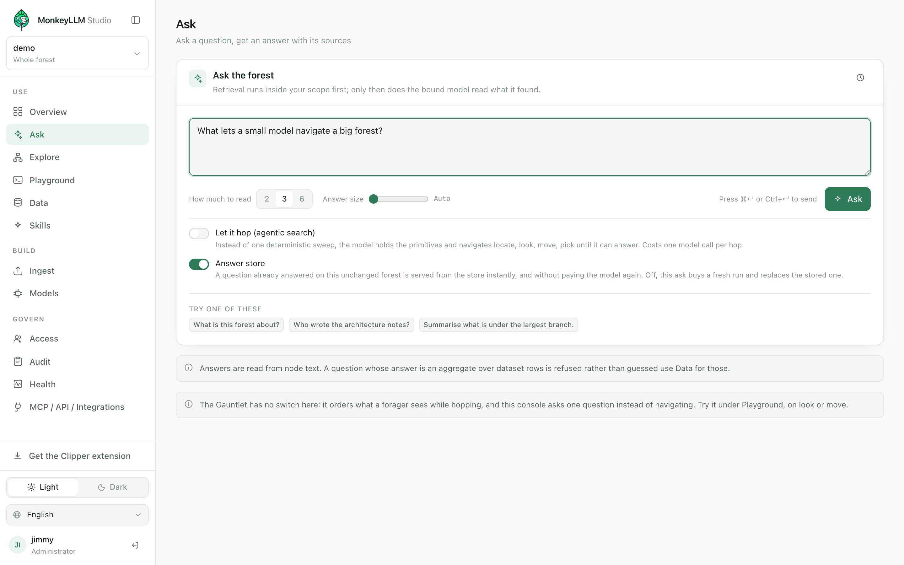
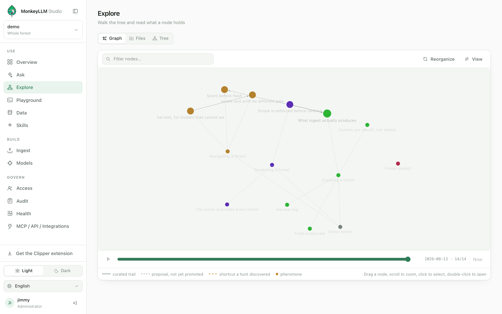
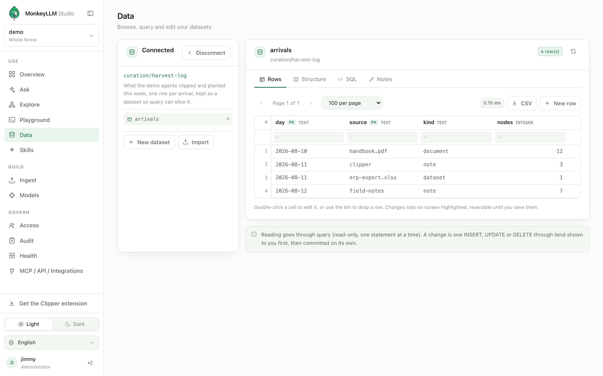

# Using the forest

English · [Português](../pt/using.md) · [Español](../es/using.md)

[← Handbook](./README.md)

Four consoles do the day-to-day work of reading a forest. **Ask** answers
questions with evidence. **Explore** shows the forest itself — as a graph,
as files, as a tree. **Data** is a database client over your datasets.
**Playground** shows you the raw calls, exactly as an agent makes them.

All four are windows over the same primitives your AI gets through MCP.
Nothing on this page is a console-only power: whatever you can do here, an
agent with the same key can do from outside.

## Ask

Ask is the landing console because it needs no explanation: type a
question, get an answer. What makes it different from a chat window is
what happens underneath, and how much of it you are shown. Retrieval runs
inside your scope first — deterministic, cheap, no model involved — and
only then does the forest's bound model read what was found and write the
reply.

**The evidence is not decoration.** Every id listed under the answer was
actually read to produce it. Click one and it opens in Explore, so a claim
in the answer is always one click from the text it came from. The **What
it read** panel goes further: the exact snippets and sections the model
was given, with section and line numbers — the summary decides *which*
node, the body is what gets read, and this panel shows both halves.

A few controls sit beside the ask box:

- **How much to read** — how many nodes the retrieval hands the model
  (2, 3 or 6).
- **Answer size** — a slider from "Auto" up to a hard ceiling. This is
  your own preference: it is remembered in your browser, per person, and
  never enters the address. "Auto" sends nothing and the forest's own
  binding rules. When you do set a size, it is not just a cut-off — the
  stated size is written into the prompt, so the model shapes the reply
  to fit instead of being truncated mid-sentence (spec J.10.8).
- **Let it hop (agentic search)** — instead of one deterministic sweep,
  the model holds the primitives and navigates — locate, look, move,
  pick — until it can answer. Costs one model call per hop, and the
  **Where it went** panel shows every hop: what the model chose, what
  came back, and the two clocks (the forest call, and the model turn
  that decided to make it).
- **Answer store** — on by default, because it is free: a question
  already answered on this unchanged forest is served from the store
  instantly, without paying the model again. Turn it off to buy a fresh
  run and replace the stored one.

**Cached answers say so.** A served answer carries a **From the store**
badge, and the recorded cost is never re-billed. This is not a dumb
cache: retrieval still runs on every ask, and the stored reply is served
only while what would be read today matches what was read then — a
forest that changed under the question gets a fresh answer, not a stale
one (spec J.10.7).

**Answers can show the images the model actually read.** When the
material contains a `media` node — a screenshot, a diagram, a photo that
came in with a description — the model may embed it in the reply as
`` (spec J.10.9). The console resolves that
reference with *your* credential: an id the model invented, or one your
scope may not read, renders as its caption and nothing else — never an
error that outranks the answer. Evidence of type `media` shows its image
beside its summary either way, because "what was this answer built from"
includes the pixels.

You can take an answer with you — **Copy cURL** (the same call, ready
for a script), **Download .md** (with `media:` references rewritten to
fetchable addresses) or **Save as PDF**. Every run is also kept in your
browser's own history — on this machine only, never sent to the Station
— so you can restore an old run and compare it with a fresh one.

> **Note** — answers are read from node text. A question whose answer is
> an aggregate over dataset rows is refused rather than guessed; use the
> Data console for those.

## Explore

Explore is one console with three ways of looking at the same forest
(spec J.5.4). The selection survives a mode change, deliberately:
switching from the graph to the files is not a new question, it is the
same node seen differently.

| Mode | Shows | Good for |
|---|---|---|
| **Graph** | nodes and typed trails, laid out spatially | seeing the shape: hot regions, proposals, shortcuts, orphans |
| **Files** | the forest as it lives on disk, one file open at a time | reading — prose as prose, a database as a table, source one click away |
| **Tree** | the branch hierarchy as a list, with search | narrow scopes, and finding where something lives |

On the **graph**, every visual channel is a fact the forest holds:
colour is the node's type or home branch, size and glow follow heat (the
pheromone reads deposit), and a proposed link — one the Ranger manages,
not yet promoted — is drawn differently from a curated trail. The
timeline replays the forest's growth in planting order. Drag a node,
scroll to zoom, click to select, double-click to open it in Files.

In **Files**, a node opens as what it is. The **Reading** view renders
the markdown; **Source** shows the two stored halves honestly — the
passport as the catalog holds it, and the body as stored. The side panel
carries three tabs: **Passport** (type, summary, tags, trails out),
**Index** (this node's entry in its parent index — derived, never edited
by hand) and **Trails** (heat, and where it connects). A dataset's `.db`
opens as browsable tables — served by the same read-only `query`
primitive as everywhere else, capped and timed out, never a private
side-channel.

**Reading a passport vs reading a body:** the passport (what `look`
returns) is the curated scent — id, type, summary, tags, trails. It is
what search matches and what an agent navigates by. The body (what
`pick` returns) is the full text, and it costs more to read — a body
over the reading budget comes back as its outline, section by section,
rather than pretending to be whole.

**Editing is governed.** With the write capability, the **Edit** button
opens the node editor: rich text or markdown, your choice. The id, type
and creation date are fixed for the life of the node; the summary is
validated against its token budget; a large body is edited one section
at a time, because a section is what a `graft` replaces atomically. The
**Pending changes** panel shows exactly what will be sent, in the shape
the API receives it — and the result is a git commit stamped with your
principal. No surface, this console included, writes a file directly:
the commit, the validation and the audit record *are* the write.

Brand-new prose enters through the Ingest console's **Write** tab:
compose with review — the same pipeline an uploaded file walks reads
your text, writes the summary, proposes where it connects, and shows
you everything before anything is planted. See
[Feeding the forest](./feeding.md).

## Data

Datasets are the one kind of node whose contents text search cannot see:
the facts live in a SQLite payload beside the passport. The Data console
is a database client over them — and everything it does goes through the
same two primitives an agent gets: `query` to read, `tend` to write.

Pick a dataset and its tables appear underneath it; the first one opens
with its rows already loaded. Four tabs:

| Tab | What it holds |
|---|---|
| **Rows** | the table as a grid — page, sort, filter, export CSV, and (with the `tend` capability) edit |
| **Structure** | columns, types and the stored declaration — read-only by design |
| **SQL** | free-form read-only queries, with the manual's own examples one click away |
| **Notes** | what you teach the agent about this data |

**Every dataset carries its own map.** At ingest, the Gardener writes a
`## Query manual` (every table, every column) and `## Sample rows`
(first three rows per table, cells clipped) into the passport — so an
agent, or you, can see what is queryable without opening a five-gigabyte
payload. The SQL tab offers the manual's example queries as starting
points.

**Reading is budgeted, and truncated means narrow your question.**
`query` accepts a single `SELECT` (or `WITH`), injects `LIMIT 200` when
you give none, and bounds the *response* at 2,000 tokens (spec C.5.1).
Two flags tell you two different things:

| Flag | What happened | The way out |
|---|---|---|
| `limited` | the injected `LIMIT 200` was reached — the query matched more rows | narrow your filter |
| `truncated` | the token budget dropped rows the query returned | narrow your projection — name the columns you need |

The `columns` list is never dropped: a result whose every row was
refused still tells you exactly which columns your statement produces,
which is the map back. And the missing rows *exist* — `truncated` never
means "nothing else matched". Aggregates are unaffected by construction:
`SELECT SUM(x)` is one short row, and computing the aggregate in SQL
instead of pulling rows is the right move for you and the agent alike.

**Notes are where a person teaches the agent** (spec C.2.1). Structure
and sample rows are read off the file; *meaning* is not — which column
is USD and which BRL, what a status code stands for, which join answers
the question people actually ask. Whatever you write in the Notes tab
comes back on every `look` of this dataset, and travels with it into
every answer the host assembles — before any SQL is written. It is
saved as one `graft`, one commit; the Gardener never overwrites it, so
it survives every sync and re-import.

**Writes are single statements, shown first.** Double-click a cell to
edit it, use the bin to drop a row, add rows with **New row** — changes
stay on screen, highlighted and reversible, until you save. Saving shows
the exact `INSERT`, `UPDATE` and `DELETE` statements `tend` will run;
nothing is written until you apply them, and each statement becomes its
own git commit. `tend` requires a `WHERE` on every `UPDATE` and
`DELETE`, and it refuses DDL forever (spec C.10): a table is born
through `plant`'s declarative schema and changes by being rebuilt —
which is why the Structure tab has no edit button rather than one that
always fails.

> **Note** — creating and importing datasets also live here: **New
> dataset** declares tables and columns and plants them in one call (the
> console never writes DDL), and **Import** sends `.db`, `.csv`,
> `.json`, `.xls` and `.xlsx` files to the Gardener as a proper ingest
> batch — nothing is parsed in the browser. See
> [Feeding the forest](./feeding.md).

## Playground

The Playground is the honest window into MCP: the same calls an agent
makes, with the same budgets — nothing here is a simulation. Pick a
primitive, fill in its arguments, run it, and read exactly what came
back: the request as sent, the response as received, and the clocks
separated so the engine's time is never confused with your network's.

| Call | What it does | Budget (tokens) |
|---|---|---|
| `locate` | find entry points by curated metadata | 800 |
| `sniff` | literal search inside bodies | 800 |
| `harvest` | one-shot retrieval with snippets | 4,000 |
| `look` | one node's passport | 500 |
| `move` | the trails from a node | 600 |
| `answer` | retrieval plus the bound model | — |

This is where "what does the agent actually see?" gets answered call by
call: run the `locate` your question would start from, then the `look`
it would follow with, and read the same JSON the model reads — budgets,
`truncated` flags and all. The panel also reports how large the searched
corpus was and what the engine's own clock says, so a half-millisecond
`locate` is reported as a half-millisecond `locate` even when the round
trip took thirty.

Every run comes with its cURL — same route, same key, same rules your
applications get — and the panel names the MCP endpoint: point any agent
harness at `/mcp/` on your Station as a streamable-HTTP MCP server, with
the same key, and it gets these calls as tools.

## This is your AI's page too

Everything above is a human window over a machine surface. Ask is the
`answer` primitive; Explore reads with `look`, `pick` and `move`; Data
is `query` and `tend`; the Playground is all of them, undisguised. An
agent connected over MCP holds the same tools under the same scope and
the same budgets — the console is a window, and the forest behind it is
the product. To hand these calls to your AI, see
[Connecting your AI](./connecting-ai.md).
