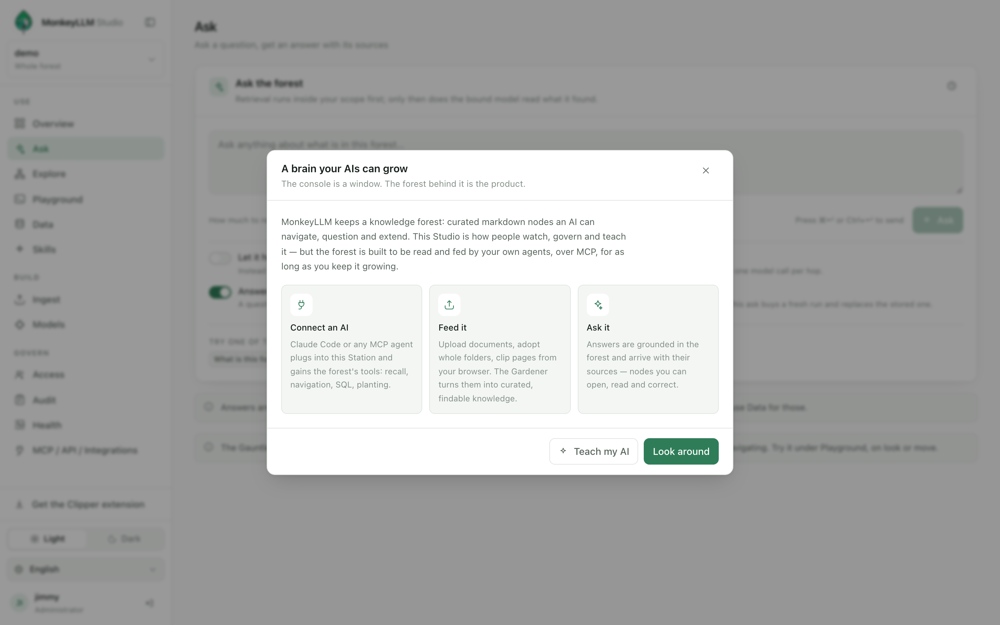
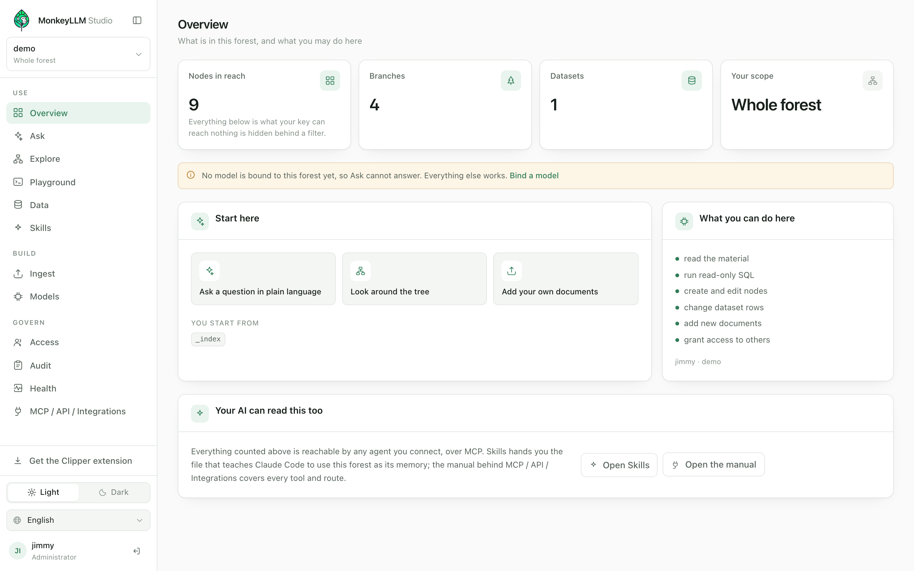

# O Manual do MonkeyLLM

[English](../en/README.md) · Português · [Español](../es/README.md)

## A proposta

Esta implantação mantém uma **floresta de conhecimento**: nós de markdown
curados, cada um carregando um passaporte com título, resumo, tags e
arestas tipadas, mais os índices leves que os tornam encontráveis. Uma IA
não recebe um despejo de recuperação — ela *navega*: entra pela busca,
percorre as arestas, lê exatamente o nó de que precisa e planta o que
aprende como um nó novo. A floresta lembra entre conversas, entre agentes,
por quanto tempo você a mantiver crescendo.

Na primeira vez que você entra, o console diz sem rodeios: **"Um cérebro
que as suas IAs podem cultivar. O console é uma janela. A floresta atrás
dele é o produto."** Essa frase é a arquitetura inteira. Mantenha-a em
mente em cada página deste manual — nada do que você vê no navegador é a
coisa em si; é uma vista sobre uma floresta que os seus próprios agentes
leem e alimentam via MCP.

*(As capturas de tela deste manual mostram o console em inglês.)*

Ao redor da floresta fica a **Station**, o host auto-hospedável: um
contêiner, REST sob `/v1`, MCP sob `/mcp`, identidade, política por
floresta e uma trilha de auditoria — para que uma floresta possa ser um
ativo compartilhado e governado em vez de um diretório pessoal. A Station
também serve o **Studio**, o console web onde pessoas observam, governam e
ensinam a floresta: fazem perguntas fundamentadas, percorrem a árvore,
ingerem documentos, concedem acesso, ligam modelos.

O público de verdade, porém, são as suas IAs. O Claude Code ou qualquer
agente capaz de MCP se pluga na Station e ganha as tools da floresta —
recuperação, navegação, SQL sobre datasets, plantio. O que um agente salva
hoje, outro recupera no mês que vem; as correções que uma pessoa faz no
console são o que o próximo agente lê. A floresta é a memória
compartilhada; o console e os agentes são duas mãos alimentando o mesmo
cérebro.

Quando você abre uma floresta, o console de Visão geral orienta: quantos
nós, galhos e datasets a sua chave alcança, por onde começar e o que você
pode fazer ali. Tudo o que ele conta está ao alcance de qualquer agente
que você conectar — essa simetria é o ponto.

> **Nota** — Tudo o que o Studio faz viaja pelas mesmas rotas que qualquer
> cliente pode chamar; não existe canal lateral privilegiado. O que quer
> que o console mostre a você, um cliente de API com a mesma chave também
> poderia buscar.

## Como as peças se encaixam

| Peça | Em uma linha |
|---|---|
| **Floresta** | O produto: nós de markdown curados com passaportes, índices leves e o seu próprio histórico git — o conhecimento em si. |
| **Primitivas do Vine** | As dez tools MCP com que um agente navega — `locate`, `look`, `move`, `pick`, `scan`, `sniff`, `query` para ler; `plant`, `graft`, `tend` para escrever — mais compostas como `harvest` e `answer`. |
| **Station** | O host auto-hospedável: REST `/v1`, MCP `/mcp`, identidade, política por floresta e auditoria envolvendo o motor intacto. |
| **Studio** | O console web que a Station serve — como pessoas observam, governam e ensinam a floresta. Uma janela, nunca o produto. |
| **Clipper** | Uma extensão de navegador que recorta a página que você está lendo para dentro de uma floresta — artigo ou seleção como markdown, captura de tela como um nó de mídia. |
| **Skills** | O console que entrega ao seu agente um pequeno arquivo de instruções ensinando-o a usar esta floresta como a sua memória persistente. |

## Sumário

| Página | Depois dela, você consegue |
|---|---|
| [Instalar e implantar](./install.md) | Subir uma Station — via Docker Compose ou a partir do código-fonte — e manter tudo o que vale guardar em volumes nomeados. |
| [Primeiro acesso](./first-access.md) | Entrar pela primeira vez, assumir a implantação e entender exatamente o que a sua chave alcança. |
| [Usando a floresta](./using.md) | Fazer perguntas que chegam com as suas fontes, percorrer a árvore em Explorar e consultar datasets em Dados. |
| [Alimentando-a](./feeding.md) | Enviar documentos, espelhar pastas inteiras e recortar páginas do navegador — e deixar o Gardener transformá-los em conhecimento curado e encontrável. |
| [Conectando a sua IA](./connecting-ai.md) | Parear uma chave sua, apontar o Claude Code — ou qualquer agente MCP — para esta Station e entregar a ele a skill que faz da floresta a sua memória. |
| [Gerenciando e governando](./managing.md) | Conceder e escopar acesso, ligar modelos, ler a auditoria e manter a floresta saudável ao longo do tempo. |

## Se você só ler uma página

Leia [Conectando a sua IA](./connecting-ai.md). O console consegue
perguntar, navegar e ingerir sozinho, mas a floresta foi feita para ser
lida e alimentada pelos seus próprios agentes — uma floresta só tocada
através da janela é um cérebro que ninguém está cultivando. Aquela página
leva você até o fim em três passos: pareie uma chave que seja sua (ela só
pode estreitar o seu acesso, nunca acrescentar), registre a Station como
um servidor MCP e entregue ao seu agente o arquivo de skill que o Studio
gera para esta implantação exata. Todas as outras páginas aprofundam o que
aquela começa.
