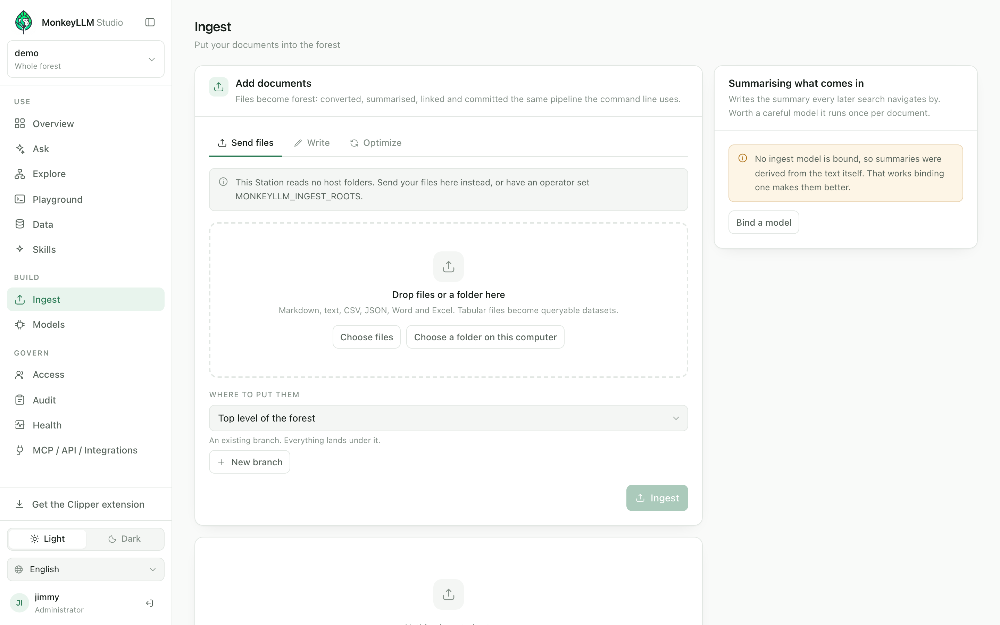

# Alimentando a floresta

[English](../en/feeding.md) · Português · [Español](../es/feeding.md)

[← Manual](./README.md)

Uma floresta cresce sendo alimentada. Tudo nesta página uma pasta
solta na tela, um artigo colado, uma planilha, uma captura de tela, uma
página web recortada percorre a mesma esteira: convertido em markdown
ou em dataset, recebe um resumo (o *cheiro* pelo qual cada salto seguinte
navega) e é commitado no git da própria floresta. O console é a janela
pela qual você a alimenta; os nós que ele planta são o produto, e
continuam úteis muito depois de a aba ser fechada.

## O console de Ingestão

O console de Ingestão ("Adicionar documentos") é onde arquivos viram
floresta: convertidos, resumidos, ligados e commitados o mesmo pipeline
da linha de comando. Ele oferece até quatro abas:



*(As capturas de tela mostram o console em inglês.)*

| Aba | O que faz | Como responde |
|---|---|---|
| **Enviar arquivos** | envia arquivos do seu computador; a Station os prepara e adota | um job que você pode acompanhar |
| **Escrever** | um documento de sua autoria, curado e mostrado a você *antes* de plantar | no lugar, com revisão |
| **Espelhar uma pasta** | espelha um diretório que o **host da Station** consegue ler | um job que você pode acompanhar |
| **Otimizar** | relê a pasta espelhada (sync), reconstrói o índice, atualiza a camada vetorial | a releitura é um job como qualquer lote; as ações de índice e de vetor rodam enquanto você espera |

Todo modo pergunta **onde colocar**: um galho existente, e tudo aterrissa
abaixo dele. Adicionar documentos exige a capacidade `ingest`.

### Enviando arquivos

Solte arquivos ou uma pasta na aba **Enviar arquivos**. Markdown, texto,
CSV, JSON, Word e Excel são todos entendidos; arquivos tabulares viram
datasets consultáveis ([veja abaixo](#datasets)). Arquivos acima de 25 MB
— ou sem conversor para o seu formato ficam de fora, e o console diz
isso em vez de pulá-los em silêncio. Nada é interpretado no navegador: os
bytes viajam até a Station e o Gardener faz a leitura.

### Escrevendo no lugar, com revisão

A aba **Escrever** é para o artigo que você acabou de colar, a nota que
acabou de terminar, a coisa que acabou de aprender. Ela percorre a mesma
esteira de um arquivo enviado mas para antes de plantar e mostra o
rascunho a você primeiro (spec J.8.1):

- o id do nó e o galho sob o qual ele vai viver,
- o **resumo** o cheiro pelo qual cada salto seguinte navega,
- as tags,
- as **conexões propostas**, cada uma nomeada pelo título daquilo para
  onde aponta.

Nada foi escrito até esse ponto: nenhum nó, nenhum commit, nenhum galho.
Você pode editar o resumo, derrubar um link proposto ou descartar o
rascunho inteiro. Quando você publica, o resumo aprovado é plantado
exatamente como você o aprovou nunca re-curado pelas suas costas.

> **Nota** links mantidos ficam em confiança 0,3, que é precisamente a
> população que o Ranger promove ou poda com base em tráfego real. Um
> link do qual você tem *certeza* se faz editando o nó, não pela
> ingestão.

### Espelhando uma pasta do servidor

**Espelhar uma pasta** adota um diretório que vive no disco da própria
Station útil quando o corpus já está no servidor, ou é grande demais
para empurrar por um navegador. Como o caminho é lido com o acesso de
arquivos da Station (não o seu), este é um ato privilegiado: exige a
capacidade `admin` na floresta, *e* o caminho precisa estar dentro de uma
das **raízes de ingestão** configuradas da Station:

```bash
# OS path-separated list of directories the Station may read on request.
MONKEYLLM_INGEST_ROOTS=/srv/dumps:/srv/exports
```

O padrão é **vazio, e vazio significa nenhuma** (spec J.8.2): uma Station
sem configuração recusa todo caminho do host para o admin e para o dono
igualmente enquanto **Enviar arquivos** e **Escrever** seguem
funcionando, porque carregam os próprios bytes. `admin` não é um atalho
por cima: a capacidade responde *quem pode pedir*, as raízes respondem
*o que existe para ser pedido*. Quando nenhuma raiz está configurada, a
aba Espelhar nem aparece, e a recusa nomeia a configuração para que um
operador que *queria mesmo* espelhar uma pasta saiba exatamente o que
configurar.

Depois que uma pasta foi espelhada, a aba **Otimizar** reexecuta o
espelhamento: o botão **Ingerir** dela relê a pasta que você espelhou por
último mostrada ao lado do botão, para você sempre ver o que será
relido e atualiza só o que mudou, por diff de hash. Um sync mantém os
resumos que alguém já aprovou: a curadoria nunca roda nele.

### Lotes são jobs

Os modos em lote enviar, espelhar, atualizar respondem imediatamente
com um **job** (spec J.9), e o trabalho roda na Station:

- **Um lote por floresta por vez.** Um segundo lote enquanto um roda é
  recusado, nomeando o job em execução para que o console possa
  mostrá-lo a você em vez de começar trabalho invisível.
- **A página acompanha o job, não o segura.** O id do job em execução
  viaja no endereço (`?job=`), então um reload restaura a visão de
  progresso lendo um registro nunca re-executando coisa alguma.
  Navegar para outro lugar não perde nada; o job não precisa da plateia.
- **A pílula segue você.** Em todo console da floresta, um pequeno
  indicador anuncia o lote em execução feitos sobre o total, o
  documento na mão, erros até agora e se expande no cancelar e no
  caminho de volta ao console de ingestão.
- **O próximo lote espera na aba.** Enquanto um job roda, o botão oferece
  **Entrar na fila**: os lotes começam sozinhos, em ordem, quando o que
  está rodando termina. A fila é visível onde espera, vive na sua aba e
  morre com ela o host em si nunca enfileira trabalho invisível. Se
  você *parar* um lote, a fila segura e espera por você.
- **Cancelar é limpo.** Um cancelamento entra em vigor na próxima
  fronteira de documento um documento é inteiro ou ausente, nunca
  metade. O que foi plantado permanece (aquilo são commits), e espelhar a
  pasta de novo a partir de **Otimizar** completa o restante sem duplicar
  nada.

> **Nota** um reinício da Station esquece *registros* de jobs, nunca o
> *trabalho*: o trabalho é commits, e o relato da própria floresta é a
> trilha de auditoria e o `git log`. Um endereço nomeando um job
> esquecido diz isso com todas as letras.

Quando o lote termina você recebe o relatório sem cortes: criados,
atualizados, sem mudança, deixados de fora, sem conversor, erros. Uma
ingestão parcialmente bem-sucedida que reportasse sucesso seria pior do
que uma que falha.

## Curadoria o único estágio com LLM, sempre dispensável

Entre a conversão e o plantio fica a **curadoria** (spec G.4), o único
estágio em que um modelo pode estar envolvido e o único estágio que
nunca trava por falta de modelo:

- **Sem um modelo ligado**, o resumo é derivado do texto de abertura do
  documento, marcado `source: ingest` em confiança 0,7. Tudo ainda
  ingere; o console avisa que um modelo ligado deixaria os resumos
  melhores.
- **Com o vínculo `ingest` da floresta** (definido em Modelos veja
  [Administrando](./managing.md)), o Curator escreve um resumo de verdade
  e as tags, propõe até três links `related-to` e consolida os resumos de
  galho, para que toda região carregue um cheiro também.

Os links propostos são escolhidos de uma **lista fechada de candidatos**
que o catálogo oferece o modelo pode escolher da lista ou não escolher
nada, então um alvo de link alucinado é estruturalmente impossível. Não
escolher nada é uma resposta válida e comum.

**"Nada a fazer" não é uma rejeição.** Um lote de arquivos sem mudança,
ou de datasets (que são resumidos pela própria estrutura), não precisa de
modelo e o relatório diz isso: *"Nada neste lote precisava do modelo…
O vínculo está bom."* Uma rejeição de modelo genuína sempre deixa um
fallback ou uma nova tentativa para trás no relatório; esse é o
discriminador. Os dois têm consertos opostos um é outro modelo ou outro
prompt, o outro é nada e o console nunca vai mandar você ajustar um
modelo a quem nada foi perguntado.

## Datasets

Arquivos tabulares viram **datasets**: payloads SQLite de verdade que um
agente pode consultar via `query` com SQL somente leitura. Duas coisas
diferentes acontecem dependendo do que você alimenta (spec G.2.2):

- **Um `.db` é adotado inteiro.** Um arquivo SQLite é o único formato que
  a floresta já fala o payload de um dataset *é* um banco SQLite —
  então os bytes são copiados para o lugar, nunca reinseridos linha a
  linha. Tipos, views, índices e BLOBs sobrevivem todos, e um banco de
  5 GB custa o mesmo para adotar que um de 5 MB.
- **Um `.csv`, `.json`, `.xls` ou `.xlsx` é convertido** num dataset
  recém-nascido com tipos de coluna inferidos. Uma pasta de trabalho
  converte **todas** as planilhas, uma tabela por planilha pegar a
  primeira e jogar fora o resto é como uma planilha chega sem os dados
  pelos quais alguém a adotou.

De um jeito ou de outro, o passaporte do dataset carrega o **mapa de
amostra** (spec G.2.3): um `## Query manual` nomeando toda tabela e toda
coluna com seu tipo, e um `## Sample rows` mostrando as três primeiras
linhas de cada tabela células cortadas, tabelas largas amostradas em
doze colunas, no máximo vinte tabelas amostradas, e toda omissão
declarada. O mapa importa porque um `.db` é opaco para todo primitivo
textual que a floresta tem: aquelas três linhas por tabela são o que o
`sniff` consegue ver dentro de um payload o vocabulário, o formato dos
ids, o formato das datas. Não é um substituto do `query`; é o cheiro que
diz a um agente *qual* dataset consultar.

> **Nota** os tetos usuais de schema (10 tabelas, 50 colunas) guardam
> contra um *modelo* inventando um schema; eles não se aplicam a dados
> que você já possui. Um export de ERP real com 141 colunas adota sem
> problema o custo limitado vive no mapa, não numa recusa.

Datasets também podem **nascer no console Dados** (spec J.5.10): **Novo
dataset** pede um nome, um galho e as tabelas e colunas que você declara
— campos, não SQL. O console nunca escreve DDL; a Vine gera o
`CREATE TABLE`, cria o `.db` e comita apenas o `.md` uma chamada
`plant`. O id é composto a partir do nome, mostrado antes da chamada e
imutável depois dela. O **Importar** do console Dados faz o mesmo que o
Enviar arquivos do console de ingestão mesmos conversores, mesma
curadoria, mesmo job, mesma pílula nunca um parser privado no
navegador.

## Mídia

Uma imagem nunca é "sem suporte" (spec G.5.1). Imagens (`.png`, `.jpg`,
`.jpeg`, `.gif`, `.webp`) e áudio (`.mp3`, `.wav`, `.m4a`, `.ogg`,
`.flac`) plantam como nós **`media`**: os bytes originais viram o
payload, e o corpo é o substituto textual que a floresta busca texto
para encontrar, binário para consumir.

O que esse corpo diz depende dos modelos da floresta:

- Sem um modelo de visão ligado, um stub embutido escreve o que se sabe:
  o formato, o tamanho, e que nenhuma descrição está disponível ainda. O
  nó existe, é encontrável pelo nome do arquivo e pelo lugar, e pode ser
  descrito depois.
- Com um modelo ligado ao papel de **visão** ("Descrever imagens" em
  Modelos), o descritor escreve o que a imagem mostra **e qualquer texto
  legível nela** que é o que torna um slide, um quadro branco ou um
  fluxograma encontráveis pelo `sniff`, já que o `sniff` lê o substituto
  textual e nada mais. Ele roda uma vez por imagem na ingestão, e a sua
  descrição é tudo que uma imagem vai dizer vale ligar um modelo fiel.

Um descritor que falha endpoint fora do ar, imagem recusada, lento
demais cai no stub com o motivo no relatório. Um modelo quebrado nunca
aborta uma ingestão.

## O Clipper

O **Clipper** (spec J.15) é uma extensão de navegador que recorta a
página que você está lendo para dentro de uma floresta um cliente como
qualquer outro, usando os mesmos caminhos de escrita que o console usa:

- **O artigo legível, ou só a sua seleção,** chega como markdown pela
  mesma esteira do compose, revisão incluída.
- **Uma captura de tela** a vista visível, ou uma região arrastada que
  você pode ajustar e anotar chega como um nó `media` pelo upload,
  descrita pelo modelo de visão ligado como qualquer outra imagem.
- **Uma nota vai junto**: o seletor de região aceita uma nota, digitada
  ou ditada, que viaja como um compose pareado nomeando a captura assim
  a imagem e as suas palavras sobre ela aterrissam como dois nós que
  referenciam um ao outro.
- **Todo recorte carrega seu endereço.** Composes terminam com uma linha
  `Source:`; uploads carregam a URL da página e ela sobrevive a toda
  atualização, então o nó de uma captura sempre diz de *qual* página ela
  é uma captura.

No primeiro uso ele pede o origin da Station e o seu usuário e senha, uma
vez. A senha é trocada na hora e nunca armazenada: o que o Clipper guarda
é uma **chave pareada** estreitada a `read` + `ingest`, expirando em 90
dias, revogável a qualquer momento em Acessos. Parear só pode estreitar a
sua própria autoridade, nunca acrescentar a ela.

Se a floresta está ocupada um lote no meio da execução responde
`E_LOCKED` o Clipper enfileira o recorte do lado do cliente e tenta de
novo, resolvendo com uma notificação enquanto você continua navegando. A
fila morre com o navegador; o host nunca enfileira.

Baixe-o pela barra lateral **Baixar a extensão Clipper** ou de
`GET /clipper.zip` no origin da sua Station. O console MCP / API /
Integrações acompanha a instalação passo a passo (carregar sem
compactação, fixar na barra). A distribuição é autosserviço, como o
pareamento: toda pessoa autenticada recebe o download, não só
administradores. Ele só lê uma página quando você clica nele ali.

## Ensinando a seção `## Notes`

O mapa de amostra diz o que está *dentro* de um dataset. Ele não consegue
dizer o que os dados *significam* que uma coluna é USD enquanto outra é
BRL, que `status` usa códigos de uma letra, qual join responde à pergunta
que as pessoas fazem de verdade. Esse conhecimento vive na cabeça de
alguém, e um agente escrevendo SQL sem ele escreve SQL que roda e
responde errado a pior falha que este sistema pode produzir, porque
parece sucesso.

Por isso um dataset carrega uma seção **`## Notes`** (spec C.2.1), e ela
é sua:

- **Escreva-a no console Dados**, na aba **Notas** ao lado de Linhas,
  Estrutura e SQL (exige a capacidade `write`). Salvar é um graft, um
  commit versionado e atribuído como todo o resto.
- **Nada mais toca nela.** O Gardener reescreve as duas seções geradas e
  só elas, então as suas notas sobrevivem a todo sync, a toda readoção, a
  toda substituição de payload. A curadoria também nunca a escreve: o
  palpite de um modelo sobre o que uma coluna significa é exatamente o
  que esta seção existe para corrigir.
- **Ela viaja com o dataset em todo caminho.** Qualquer material que o
  host monta para um modelo carrega as notas de todo dataset presente
  nele `look` as devolve, o harvest de um golpe só as carrega, a
  entrada da resposta que navega as carrega. Incondicionalmente: a sua
  nota compartilhar ou não vocabulário com a pergunta de hoje não é
  motivo para reter as suas instruções sobre como ler os dados.

O placeholder do próprio console mostra o registro em que escrever:

```
valor_total_invoice é USD; valor_cambio é BRL.
status: A = aberto, C = cancelado, F = fechado.
Importação direta são as linhas em que arrendatario está vazio.
```

Algumas frases aqui são as palavras de maior alavancagem na floresta:
escritas uma vez, lidas em toda pergunta que toca o dataset.

---

A floresta está alimentada. Agora conecte as IAs que vão lê-la e
fazê-la crescer de fora: [Conectando suas IAs →](./connecting-ai.md)
