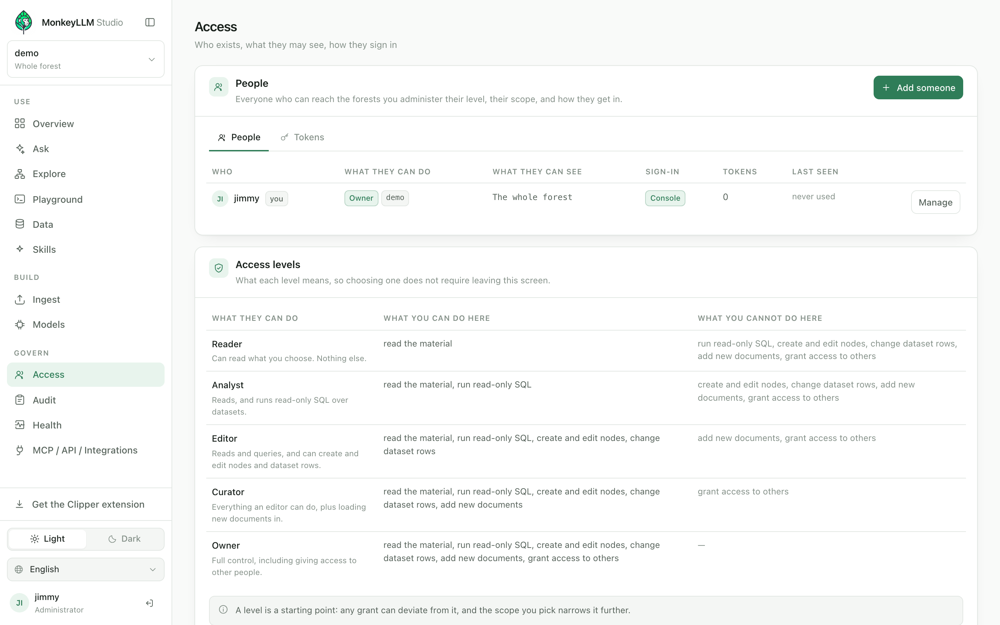
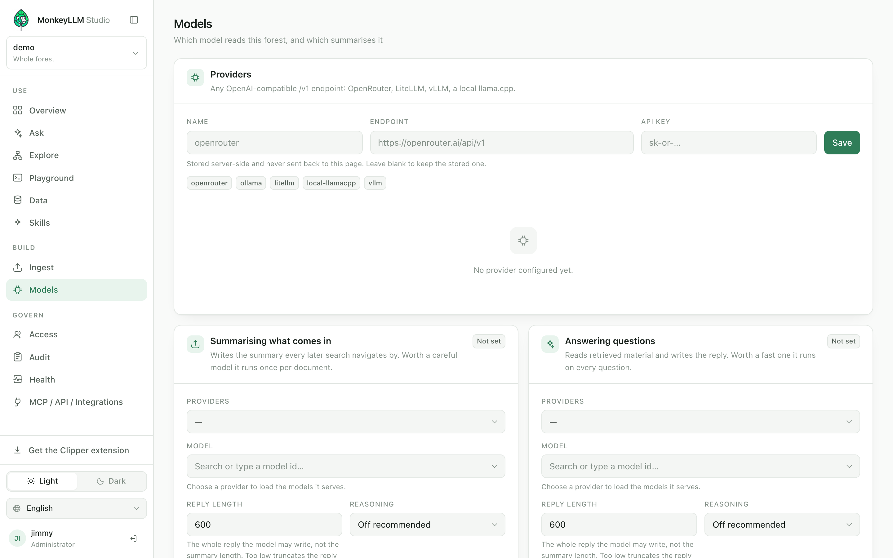
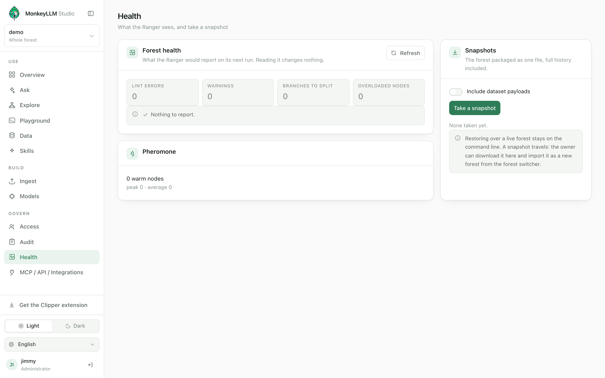

# Gerenciando e governando

[English](../en/managing.md) · Português · [Español](../es/managing.md)

[← Manual](./README.md)

A floresta é o produto; esta página é sobre mantê-la governada e saudável.
Cinco consoles carregam esse trabalho **Acessos**, **Modelos**, **Saúde**,
**Auditoria** e a aba **Otimizar** da Ingestão. Os quatro consoles aparecem
só para uma chave que tenha a capacidade `admin` na floresta; a aba
Otimizar é renderizada para qualquer chave que possa `ingest` (uma simples
releitura da pasta espelhada não exige mais que isso), com apenas os seus
cartões de Reconstruir e de Atualizar a camada vetorial reservados ao
`admin`. Tudo o que eles fazem viaja pelas mesmas rotas `/v1` que
qualquer cliente de API poderia chamar: não existe canal lateral
privilegiado, e deliberadamente não existe
um painel separado de superadministrador. Um console, uma API, com
capacidades decidindo o que aparece.

## Pessoas e acessos

A governança no Studio tem a forma de uma **pessoa**, não de uma tabela de
concessões. Adicionar alguém é um formulário só quem é, o que pode ver,
como entra, e um token se os scripts dela precisarem de um porque essa é
uma decisão só, e depois toda mudança naquela pessoa começa pela linha dela
na lista: o nível, o escopo, se pode entrar, quantos tokens vivos segura, e
quando foi vista por último.



*(As capturas de tela mostram o console em inglês.)*

O acesso é concedido como **nível primeiro, capacidades depois**. Um nível
é um ponto de partida com nome, e o console documenta cada nível na própria
tela, então escolher um nunca exige sair dela:

| Nível | Pode | Não pode |
|---|---|---|
| **Leitor** | ler o material | todo o resto |
| **Analista** | ler, rodar SQL somente leitura | escrever qualquer coisa |
| **Editor** | ler, consultar, criar e editar nós, alterar linhas de dataset | adicionar documentos novos, conceder acesso |
| **Curador** | tudo que um editor pode, mais carregar documentos novos | conceder acesso a outras pessoas |
| **Dono** | controle total, incluindo dar acesso a outras pessoas | |

Um nível é só um ponto de partida: uma seção "Ajustar as capacidades" deixa
qualquer concessão fugir dele (as capacidades são `read`, `query`, `write`,
`tend`, `ingest`, `admin`), e o nível escolhido é redito em palavras
simples logo abaixo da escolha "Lê e roda SQL somente leitura sobre os
datasets." para que o que você está prestes a salvar seja dito antes de
você salvar.

Mais duas regras mantêm o formulário honesto:

- **As florestas são escolhidas como um conjunto.** O formulário oferece
  cada floresta que você administra como uma seleção múltipla uma
  pessoa, uma decisão, não uma visita a este formulário por floresta. Se um
  passo é recusado (digamos, uma floresta que você não administra), o resto
  ainda é aplicado e a recusa é listada pelo nome; nada é descartado em
  silêncio.
- **O escopo por galho só aparece quando significa alguma coisa.** Com
  exatamente uma floresta marcada, você pode estreitar a concessão a galhos
  escolhidos da árvore daquela floresta ("Só os galhos que eu escolher").
  Com várias florestas marcadas a concessão cobre cada floresta por
  inteiro, e o formulário diz isso nomes de galhos não são compartilhados
  entre florestas, então aplicar os nomes de uma floresta a outra seria uma
  mentira.

> **Nota** Escolha um escopo de zero galhos e o console avisa: essa
> pessoa não veria absolutamente nada. Um escopo vazio é uma concessão
> válida; só raramente é a que você queria.

### Chaves e tokens

A segunda aba do mesmo console lista **toda credencial que pode alcançar
esta Station** duas vistas sobre uma verdade só. Cada token carrega um
rótulo ("Pipeline de CI, Zapier, bot de staging"), um prefixo reconhecível,
uma expiração (7, 30, 90 ou 365 dias, ou nunca), e quando foi usado pela
última vez; cada um pode ser revogado na hora. O segredo em si é mostrado
exatamente uma vez, na criação só o digest é guardado, então copie na
hora ou cunhe outro.

Chaves pareadas as chaves de autosserviço que o Clipper e o console de
Skills derivam da senha da própria pessoa (`POST /v1/auth/pair`) também
vivem aqui. São tokens comuns com um detalhe: carregam uma máscara de
capacidades de no máximo `{read, ingest}`, a autoridade delas é a
interseção das concessões da própria pessoa com essa máscara **no momento
do uso** (uma concessão revogada depois some da chave imediatamente), e
elas sempre expiram 90 dias por padrão, 365 no máximo. Parear só
estreita, nunca acrescenta, e é por isso que não precisa de administrador.

Tokens de sessão o subproduto de uma entrada com senha nunca aparecem
nesta lista. Eles não são uma credencial que um operador gerencia.

Uma regra de escalonamento molda o que você pode ver: uma chave autentica
um *principal*, e um principal pode ter concessões em várias florestas,
então cunhar ou revogar as credenciais dele exige `admin` em **todas** as
florestas que ele tem. Uma pessoa que também tem uma floresta que você não
administra aparece na sua lista, mas as credenciais dela estão fora do seu
alcance o console diz isso na linha dela.

### A janela de configuração, e por que ligar não cunha nada

Uma Station recém-instalada não pertence a ninguém, e continua assim até
uma pessoa reivindicá-la: **ligar uma Station não cunha nada**. O registro
guarda exatamente a mesma autoridade depois do boot que antes dele —
nenhuma chave, nenhuma senha, nenhum principal que possa agir. É isso que
deixa a janela de configuração da primeira execução sobreviver para ser
usada.

Enquanto o registro não guarda credencial de espécie alguma, `POST
/v1/auth/setup` está aberta: a primeira pessoa a abrir o console vira a
**dona** o único principal que tem `admin` em toda floresta, presente e
futura. O primeiro boot anuncia isso na saída padrão a URL do console, e
um aviso de que um posto de dona não reivindicado numa interface pública
é uma corrida contra estranhos. Depois que a configuração rodou, a rota se
fecha permanentemente e responde exatamente como um caminho que nunca
existiu.

Duas implantações abrem mão da tela de configuração, cada uma
explicitamente:

- **Máquinas sem navegador** passam `--bootstrap-key` (ou
  `MONKEYLLM_STATION_BOOTSTRAP_KEY=1`) e a primeira chave de API —
  carregando o bit de dona é impressa uma vez no boot, dentro daquela
  mesma janela de uso único, e nunca mais.
- **Implantações break-glass** definem `MONKEYLLM_STATION_ADMIN` e
  `MONKEYLLM_STATION_PASSWORD`: uma conta mantida no ambiente, nunca
  armazenada, rotacionada reiniciando. Configurá-la fecha a configuração
  inicial, porque a implantação já declarou a sua primeira identidade.

## Modelos

Uma floresta responde perguntas, resume o que entra e descreve imagens só
se você ligar um modelo a ela. O console de Modelos é onde isso acontece —
por floresta, em duas metades: provedores e papéis.



**Provedores** são endpoints com nome qualquer URL base `/v1` compatível
com OpenAI funciona: OpenRouter, LiteLLM, vLLM, um llama.cpp local. Chaves
são somente escrita em todas as superfícies: o console reporta apenas se há
uma guardada, e deixar o campo em branco numa atualização mantém a atual,
então um endpoint pode ser corrigido sem colar de novo um segredo.
Provedores declarados pelo ambiente da própria implantação
(`MONKEYLLM_LLM_ENDPOINT`, `MONKEYLLM_EMBED_ENDPOINT`) chegam
pré-configurados e somente leitura altere as variáveis e reinicie a
Station para mudá-los.

Quando você escolhe um modelo, o console oferece o catálogo do próprio
provedor (buscado na rota `/models` dele), para você escolher um
identificador real em vez de digitar um mas ainda pode digitar um modelo
que o provedor não anuncie, porque gateways subnotificam.

**Papéis** são o que uma floresta de fato liga `(forest, role) →
(provider, model, reply length, reasoning)`:

| Papel | O console o chama de | O que otimizar |
|---|---|---|
| `answer` | Responder perguntas | Velocidade ele lê o material recuperado e escreve a resposta, a cada pergunta. |
| `ingest` | Resumir o que entra | Capricho ele escreve o resumo pelo qual toda busca futura navega, uma vez por documento. |
| `vision` | Descrever imagens | Fidelidade ele lê slides, diagramas e capturas de tela na ingestão, e a descrição dele é tudo que uma imagem vai dizer. |

Cada vínculo carrega um **tamanho da resposta** (a resposta inteira que o
modelo pode escrever baixo demais corta no meio da frase, e um modelo de
raciocínio precisa de espaço para pensar antes) e uma chave de
**raciocínio**, desligada por padrão e que só vale ligar para modelos de
pensamento híbrido.

Dois fatos que valem guardar:

- **Ligar um modelo nunca amplia acesso.** A busca roda dentro do escopo de
  quem pergunta antes de qualquer modelo ser chamado, então o modelo só lê
  o que aquela pessoa já poderia ter lido primitiva por primitiva.
- **Uma floresta sem vínculo de `answer` ainda faz tudo menos Perguntar.**
  Explorar, Dados, ingestão, busca tudo funciona; a Visão geral diz com
  todas as letras: "Nenhum modelo está ligado a esta floresta, então
  Perguntar não responde ainda. O resto funciona normalmente."

## Saúde

O zelador da floresta é o **Ranger**, e o console de Saúde é o relatório
dele "O que o Ranger reportaria na próxima passagem. Ler não muda nada."



O que o Ranger cuida, nas passagens dele:

- **Evaporação de calor.** Toda leitura deposita feromônio; sem
  esquecimento, toda trilha saturaria e o calor deixaria de discriminar. O
  calor decai exponencialmente (meia-vida de 30 dias por padrão), e linhas
  que esfriam abaixo de 0,01 são removidas como poeira. A evaporação vive
  inteiramente na camada derivada ela nunca commita.
- **Promoção e poda só de links incertos.** O Ranger gerencia exatamente
  os links nascidos abaixo da confiança total: propostas de agente e
  atalhos descobertos. Uma proposta cujos dois extremos continuam aquecidos
  é confirmada pelo uso e promovida; uma cujos dois extremos esfriaram de
  vez é podada. Arestas estruturais e links em confiança 1,0 nunca são
  tocados, toda mudança é um commit auditado só de `.md`
  (`ranger(promote)`, `ranger(prune)`), e um link que não está nem quente
  nem frio o bastante é deixado em paz paciência é um recurso. O Ranger
  nunca apaga nós.

O **relatório** exige `admin` na floresta e um escopo irrestrito ele
conta problemas na floresta inteira, então uma concessão limitada a um
galho é recusada em vez de servida com números que descrevem em silêncio
nós que ela não pode ver. Ele cobre: galhos para dividir (largos demais
para qualquer leitor), nós sobrecarregados (mais trilhas do que alguém
consegue seguir de um lugar só), erros e avisos de lint, fontes que sumiram
(o nó fica; o arquivo de onde ele veio se foi), propostas de link esperando
o Ranger, e o feromônio num relance quantos nós aquecidos, pico e média
de calor.

Ler o relatório não muda nada. O cuidado em si é uma execução agendada num
shell, um ciclo ou como serviço:

```bash
vine ranger --forest /forests/<id>              # one cycle: evaporate → tend links → report
vine ranger --forest /forests/<id> --every 3600 # service mode, repeat every N seconds
```

Numa implantação Docker, o mesmo comando roda dentro do contêiner:
`docker compose exec station vine ranger --forest /forests/<id>`.

### Snapshots

Um snapshot é a floresta empacotada num **arquivo só** o repositório git
dela como um bundle, com todo o histórico, cada plant e cada commit de
auditoria viajando junto. Do console de Saúde você pode tirar um ("Incluir
os payloads dos datasets" acrescenta um arquivo sidecar para os `.db` que o
git nunca guarda), e a pessoa **dona** pode baixar o bundle e o sidecar.

A importação passa pelo seletor de florestas: **Importar snapshot** cria
uma floresta nova a partir de um bundle, com histórico e tudo, só para a
pessoa dona o bundle entra como está, sem passar pela curadoria, que é
exatamente por que só o principal que governa o volume pode plantar um. A
floresta importada chega servível (a Station a reindexa na chegada) e fria:
nenhuma chamada de modelo é gasta, e a busca fica só por palavra-chave até
alguém construir a camada vetorial.

> **Nota** Restaurar *por cima* de uma floresta viva deliberadamente não
> é oferecido no console; isso continua na linha de comando (`vine
> snapshot restore`). Um snapshot viaja: baixe-o aqui, importe-o como
> floresta nova lá.

## Auditoria

O console de Auditoria responde "quem viu o quê". As duas metades dele são
guardadas onde cada uma pertence:

- **Leituras** caem no log de auditoria: quem, qual floresta, qual chamada,
  um digest dos argumentos, o tamanho do resultado, quando aconteceu,
  quanto tempo a floresta levou, quanto o provedor cobrou, e qual recusa
  foi quando houve recusa. Corpos e trechos nunca são copiados para lá o
  log registra acesso, não conteúdo e o console diz isso na tela.
- **Escritas** já são commits no histórico git da própria floresta, cada
  um carregando um trailer `station-principal: <name>` que nomeia o
  principal que agiu, então a história do que mudou é da própria floresta.

Juntas, as duas reconstroem a trilha completa de qualquer resposta depois
do fato: qual principal, quais primitivas, quais nós, em qual ordem. Uma
resposta servida do banco (veja abaixo) é auditada como tal a linha
carrega o digest da chave da entrada, é marcada como servida do banco, e o
custo que ela registra é o custo *evitado*, nunca um segundo gasto.

A tela abre com quatro números sobre o conjunto que você está olhando:
quantas chamadas, quantas foram recusadas, quanto foi gasto, e quanto o
banco de respostas tornou desnecessário. Esses dois números de dinheiro
ficam separados de propósito o custo de um acerto no banco é dinheiro que
*não* foi pago, e um único "custo" cobrindo os dois é uma conta que ninguém
consegue conciliar. Uma chamada cujo provedor não publica preço aparece
como sem preço, nunca como grátis.

O filtro é por pessoa, por chamada, por floresta, por desfecho (tudo, só as
recusadas, só o que veio do banco) e por data, e todo filtro fica no
endereço, então uma visão filtrada é um link que você manda para quem
precisa olhar. Os quatro números descrevem o conjunto filtrado e não a
página de linhas abaixo deles um resumo que contasse as linhas na tela
mudaria quando você mudasse quantas linhas cabem.

Lê-lo exige a capacidade `admin`, e ele mostra só as florestas que você
administra os totais são estreitados do mesmo jeito, porque contar uma
floresta é um jeito de descobrir o tamanho dela.

## Otimizar

A aba **Otimizar** do console de Ingestão reúne uma mesma tarefa contada
três vezes: manter o conteúdo em dia, manter em dia o que o encontra, e
manter a metade densa com a conta em dia. Três botões, e saber qual apertar
é a maior parte da habilidade:

| Botão | O que faz | Quando apertar |
|---|---|---|
| **Ingerir** (o botão de envio da aba) | Relê a pasta que esta floresta espelhou por último e atualiza só o que mudou. | Os documentos de origem seguiram em frente e a floresta deve acompanhar. |
| **Reconstruir** | Reconstrói o índice de busca a partir dos arquivos os arquivos são a verdade, o índice é derivado. | Qualquer coisa parece desatualizada: uma busca que não acha um nó que você consegue ler, uma floresta que chegou de um snapshot ou de uma versão anterior. |
| **Atualizar** | Embeda só os nós escritos desde que a camada vetorial foi construída pela última vez. | O console diz "*n* nó(s) foram escritos desde a última construção, então a busca híbrida ordena sem eles." |

Reconstruir (`POST /v1/admin/reindex`) exige `admin` e um escopo irrestrito
— a contagem que ele devolve é o tamanho da floresta inteira. Ele escreve
só a camada derivada: nenhum commit, nenhuma mudança de histórico, que é
também por que uma Station somente leitura ainda o oferece um índice que
ela nunca pudesse reparar degradaria para sempre.

Atualizar existe porque **uma leitura embeda só a pergunta**: fazer
perguntas nunca paga para embedar documentos, então a dívida de embedding
de uma ingestão se acumula visível como uma contagem de "stale" em vez de
se esconder na latência de busca de alguém. Até você apertar, nós novos
continuam sendo encontrados por palavra-chave; só a metade vetorial da
ordenação híbrida está atrasada. Uma atualização contra um índice ausente
ou de modelo trocado recusa em vez de encher pela metade dois espaços
incompatíveis; esse caso pede um build completo da canopy.

## Custos e orçamentos

Toda primitiva de leitura responde dentro de um **orçamento de tokens**
declarado, e o truncamento é sempre explícito um marcador `truncated:
true`, nunca um corte silencioso. A janela de contexto de um agente é o
recurso mais escasso do sistema, e os orçamentos são como a floresta a
respeita:

| Primitiva | Orçamento (tokens) |
|---|---|
| `look` | 500 |
| `move` | 600 |
| `locate`, `scan`, `sniff` | 800 |
| `query` | 2.000 linhas inteiras caem do fim; a lista de colunas nunca cai |
| `pick` | um corpo acima de 4.000 devolve o sumário de seções no lugar, guiando o agente a uma seção |
| `harvest` | 4.000 para o composto inteiro |

A única chamada que custa dinheiro de verdade é `answer` a chamada de
modelo por trás do Perguntar. A Station por isso mantém um **banco de
respostas**, por floresta: uma pergunta repetida é servida do banco, não
cobrada de novo. A busca ainda roda a cada pergunta (é a metade barata), e
o que ela recuperou decide o frescor uma entrada só é servida enquanto o
material por trás dela for byte a byte o que era, então um acerto vencido é
estruturalmente impossível e qualquer escrita na floresta invalida toda
entrada feita antes dela. Entradas nunca cruzam escopos de acesso, uma
resposta servida diz que veio de lá ("Do banco" no Perguntar, `cached:
true` na API), e a linha de auditoria registra o custo evitado em vez de
gastá-lo duas vezes.

Os controles do banco ficam no console de Modelos: ligado ou desligado por
floresta (ligado por padrão), quantas entradas são mantidas, uma expiração
opcional em horas (higiene, não correção), um botão para esvaziá-lo, e o
placar corrente acertos, falhas e tokens **não gastos**.

---

Dois lugares para ir daqui: [Instalar e implantar](./install.md) para
atualizar a própria Station tudo que vale guardar vive nos volumes
nomeados, então uma atualização é uma reconstrução, não uma migração e
[Conectando a sua IA](./connecting-ai.md), porque uma floresta bem
governada ainda é só tão viva quanto os agentes que a leem e a alimentam.
